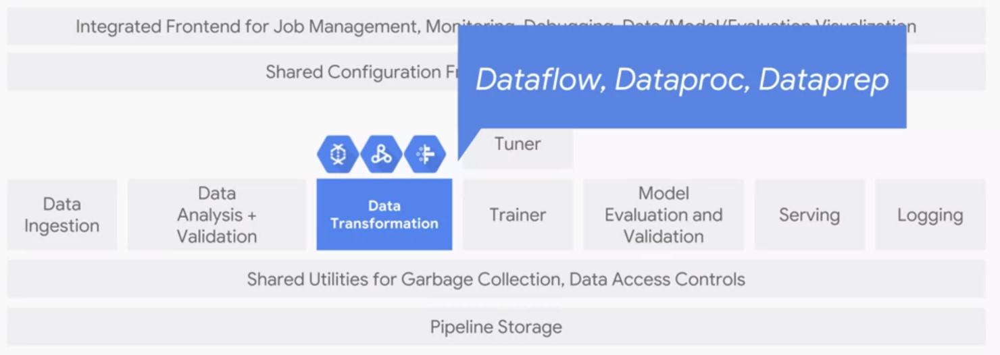

# Production Machine Learning Systems

In real-world production ML systems are large ecosystems of which a  robust model code itself is just a small part. The rest, consist of code that perform critical functions some of which we have already seen in the pipeline in my [other repo](https://github.com/Sylar257/Google-Cloud-Platform-with-Tensorflow). In this project, we will be learning good characteristics that make for good ML system beyond its ability to make *good predictions*. 

## Contents

[***Architecting Production ML System***](https://github.com/Sylar257/GCP-production-ML-systems#architecting): components we need to design and things to consider as system architects

[***Ingesting data for Cloud-based analytics and ML***](https://github.com/Sylar257/GCP-production-ML-systems#Data_ingesting): bringing data to the cloud

[***Designing adaptable ML systems***](https://github.com/Sylar257/GCP-production-ML-systems#adaptable_ml_system): how to mitigate potential changes in real-world that might affect our ML system

[***High performance ML systems***](https://github.com/Sylar257/GCP-production-ML-systems#high_performance_ML_system): choose the right hardware and removing bottlenecks for ML systems

[***Hybrid ML systems***](https://github.com/Sylar257/GCP-production-ML-systems#Hybrid_ML_system): high-level overview of running hybrid systems on the Cloud


## Architecting

In a Cloud-base ML ecosystem, the model code usually only account for **5%** of the total code. This is because in order to keep a ML system running in production, we need a lot more than just *computing the model’s outputs for a given set of inputs.* 


### data ingestion


The first component we should consider is the **data ingestion**. 

*   The input data could come from *streaming data ingestion pipeline* from a mobile, device web service, etc. For **streaming data** we use **PubSub**.

*   Another possibility is **structured data** that live in a data warehouse. Thus we might use a service such as **BigQuery**.
*   If we are transforming data from training that we can train on it later, we might use **Cloud Storage**

### data quality

Machine learning models are only *as good as their training data*. Unlike catastrophic bugs which are easy to find, small data bugs could be preternaturally hard to locate even though *they can still significantly degrade model quality over time*.Because bugs can be disastrous and hard to find, we need **data analysis** and **data validation** components. 


Exploratory Data Analysis(**EDA**) is all about understanding the distribution of our data, which is the first step in detecting small data bugs. Then we could perform helpful pre-processing for our models such as **eliminating outliers**, **adjust skewness of data**, and **correcting wrongly registered data from providers**.

Data validation is all about finding out is our data healthy or not:

1.  is the new distribution similar enough to the old one?
2.  Are all expected features present?
3.  Are any unexpected features present?
4.  Does the feature have the expected type?
5.  Does an expected proportion of the examples contain the feature?
6.  Do the examples have the expected number of values for feature?

### data transformation

The data transformation component allows for **feature wrangling.** It can do things like *generate feature to integer mappings.* Critically, whatever mappings that are generated mush be saved and reused at **serving time**. Failure to do this consistently results in a problem called **training-serving skew**. Common tools to use for data transformation are: **Dataflow, Dataproc, and Dataprep**.



We normally crate data transformation useing **dataflow & dataprep**. Its important create dataflow pipelines that are par of the model graph using TF transform and **export the transform function** for use at serving time.

### Trainer

The trainer is responsible of training our model. It should be able to support **data parallelism and model parallelism**. This could be the primary reason that we might choose TF+GCP over PyTorch since the Google has done such a amazing job behind the scence so that we, as end users, could do data and model parallelization with minimum amount of code. In addition, it should also automatically *monitor and log everything*, and support the use of experimentation. Fanally, the trainer should also support **hyperparameter tuning**. This could be naive grid search, random search or even Tree-Parzen-based Bayesian optimizer. 


There are two produts that aligned with this component in GCP: **ML Engine** which provides the managed service for TensorFlow and **GKE(Kubeflow)** which provides a managed environment for **hybrid ML models** in Kubeflow. **ML Engine** is a managed excution environment for TensorFlow that allows us to instantly scale up to hundreds of workers, and it’s automatically integrated with the three other core components: the tuner, logging and serving. It also have a built-in concept of models inversion, allowing for easy **AB testing** and there is no lock-in so that we can take our train model and run it anywhere.

### Model Evaluation and Validation

The model evaluation and validation components have one responsibility: to ensure that the models are good before moving them into the production environment. The goal is to ensure that users’ experience aren’t degraded. There are two main things that we care about with respect to model quality. **How safe** the model is to serve, and the model’s **prediction quality**.

**Safe model** refers to low chance of crashing or cause errors in the serving system when being loaded or when sent on expected inputs. It also shouldn't use more than the expected amount of resources, like memory.

**Model evaluation** is part of the *iterative process* where teams try and improve their models. However, because it’s expensive to test on **live data**, experiments are generally run off-line first. It’s in this setting where **model evaluation** takes place. Model evaluation is essentially assessing the model with respect to some *business-relevant metric* like **AUC, ROC curves or cost-weighted error**. If the model meets their criteria, then it can be pushed into production for a **live experiment.**

In contrast to the *model evaluation component*, which is human facing, the **model validation** component is not. Instead, we *design a **fixed threshold** that evaluates the model and **alerts engineers** when things go awry*.  For this we often use **TFX** for model analysis which is a part of Google internal production ML system.


### Serving and logging

The serving component should be **low-latency** to respond to users quickly. **Highly efficient** so that many instances can be run simultaneously, and **scale horizontally** in order to be reliable and robust to failures. In contrast to training when we care about scaling with our data, at serving we care about **responding** to variable user demand **maximizing throughput** and **minimizing response latency**. Another important feature is that it should be easy to update to *new versions of the model*. When we get new data or engineered new features, we will want to retrain and push a new version of the model and we would want the system to seamlessly transition to the new model version. More generally, the system should allow us to set up a multi-armed bandit architecture to **verify** which model version are the best.


Just as with training, there are two options for serving on GCP. We can either use a fully managed TensorFlow serving service which is **ML Engine** or we can run **TF serving** on **Kubernets engine**. 


The next component is **logging** which is critical for **debugging and comparison**. All logs should be easily accessible and integrated with **Cloud Reliability**.

### Training Design Decision

When training a model, there two *paradigms*, **static training** and **dynamic training**. 

In **static training**, we do what we did in my [other repo](https://github.com/Sylar257/Google-Cloud-Platform-with-Tensorflow): gather the data, partition it, train our model, and then deploy it. In **dynamic training**, we do this repeatedly as data arrive. This leads to the fundamental trade-off between static and dynamic. Static is simpler to build and test, but likely to become stale. Whereas dynamic is harder to build and test, but will adapt to changes. 

Below are some general pros & cons:


From another perspective, we can contemplate the trade-off between static and dynamic based on **peakedness** and **cardinality**:

*   **Peakedness** refers to the extent to which the distribution of the prediction workload is concentrated(similar to **kurtosis**). For example, a model that predicts the next word given the current word would be **highly peaked** because a small number of words account for the majority of words used. In contrast, a model that predicted quarterly revenue for all sales verticals, in order to populate a report, will be run on the same verticals every time and with the same frequency for each. So, it would have very low peakedness.
*   **Cardinality** refers to the number of values in the set. In this case, the set is the set of **all possible things we might have to make predictions for**. A model predicting sales revenue given organization division number, would be fairly *low cardinality*. A model predicting lifetime value given a user for an e-commerce platform would be very high cardinality, because the number of users and the number of characteristics of each user, are likely to be quite large.

Taken together, these two criteria create a space. When the cardinality is sufficiently low, we can store the entire **expected prediction workload**. When the cardinality if high because the size of the input space is large, and the workload is not very peaked, we would probably want to use **dynamic training**.

In practice, we often would choose a **hybrid of static and dynamic**, where we statically cache some of the predictions, or responding on demand for the long tail. This works best when the distribution is *sufficiently peaked*.


### Deploy trained model on Cloud AI Platform

##### Create a bucket and move our models in

```python
# parameters for creating bucket
REGION=us-central1
BUCKET=$(gcloud config get-value project)
TFVERSION=1.7
# create a new bucket with Cloud Shell
gsutil mb -l ${REGION} gs://${BUCKET}

# copy the files from G-storage to our BUCKET
gsutil -m cp -R gs://cloud-training-demos/babyweight/trained_model gs://${BUCKET}/babyweight
```

##### Deploy trained model

```python
# parameters for AI-platform
MODEL_NAME=babyweight
MODEL_VERSION=ml_on_gcp
MODEL_LOCATION=$(gsutil ls gs://${BUCKET}/babyweight/export/exporter/ | tail -1)

# deploy model in the AI-platform
gcloud ai-platform models create ${MODEL_NAME} --regions $REGION
gcloud ai-platform versions create ${MODEL_VERSION} --model ${MODEL_NAME} --origin ${MODEL_LOCATION} --runtime-version $TFVERSION
```

## Data_Ingesting

### Data On-Premise

This might be the simplest case where we just need to *drag-and-drop* the data into the **google cloud bucket**. 

We can use **gsutil** to move data to *Google Cloud Storage**:

```python
# This copy all the text files in my local directory to my GCP bucket
gsutil cp *.txt gs://my-bucket
```

In more general format:

```python
# include -m here to enable multi-threading
gsutil -m cp -r [SOURCE_DIRECTORY] gs://[BUCKET_NAME]
```

### Large Datasets

Definition of *large* here is about 60 TB of data. One of the newly available options is receiving a physical Google device called a **Transfer Appliance**, which is Google’s rackable high-capacity storage server. Once received we can load data at our own datacenter on the **transfer appliance** and ship the data over to **GCP**.

## Adaptable_ml_system

The distribution of input data can change for a number of reasons. For example, sometimes the distribution of the label changes. We’ve looked at the natality dataset in BigQuery and tried to predict baby weight. We might notice that baby weight has actually changed over time. It peaked in the 1980s and has since be declining.


When the distribution of the label changes, it could mean that the relationship between features and labels is changing as well. At the very least, it’s likely that our model’s predictions which will typically match the distribution of the labels in the training set will be significantly less accurate.

Sometimes, it’s not labels but the features that change their distributions. This would be a more obvious cause of effecting model prediction accuracy.

To remedy this, take the following precautions:

* Monitor **descriptive statistics** for our inputs and outputs
* Monitor our residuals as a function of our input
* Use custom weights in our loss function to emphasize **data recency**
* Use **dynamic training** architecture and regularly retrain our model

### Training/Serving Skew

Three common causes for this problem:

1. A discrepancy between how we handle data in the training and serving **pipeline**.
2. A change in the data between when we train and when we serve.
3. A feedback loop between our model and our algorithm.

One of the best ways of mitigating training serving skew is to *write code that can be used for both development and production.* If development production were the same, this would be relatively trivial, but often times, they’re different.

In the Jupiter notebook in this [link]() you will see how to use **polymorphism** to abstract the environment dependent aspects of the code while also **reusing the parts of the code that need to remain functionally equivalent**.

A common scenario we might encounter is that our training data is already collected and is in batches while our serving data comes in stream. In development, we might ingest data from CSV files and use our model to write our predictions to other CSV files. In production though, our users are making requests in *real-time*, and so our input will be **streaming**. 


In GCP, streaming input can be captured by **Pub/Sub** and our output could be sent to some **data warehouse**. Critically, the input and output steps are different in these two pipelines are shown above. In order to use *polymorphism* here, we will define an abstract class within our two functions read instances and write predictions, and these functions will be left **abstract**. They are **readInstances()** and **writePredictions()**. We will then implement those functions into child classes, **TextInputOoutput**, which will be our development pipeline, and **PubSub BigQuery**,which will be our production pipeline.


## High_performance_ML_system

### Training for high-performing model

Things to consider:

* training budget： time and cost
* scale: time and accuracy trade-off
* one strong machine or several weaker machines
* transfer learning for time-saving


### Predictions

Considerations for inference time:

* Time for each prediction
* Cost 
* Scale. Do we do predictions on single machines or a distributed system

We usually scale out the predictions onto **multiple workers**. Essentially, each prediction is handled by a **microservice** and we can replicate and scale out the predictions using **Kubernetes** or **App Engine**.

### Distributed training

We could run the ML model on a hardware that was suitable for GPUs or TPUs. We can also scale out the training onto *multiple machines*. However, all these three suing **heterogeneous systems** for ML training, training on distributed systems of machines or experimenting with model architectures, they all add complexity to our production ML system.

Training complex networks with large amounts of data can often take a long time. There are a number of thing that we can do to make our training faster. We can use more powerful device such as TPUs (Tensor Processing Unit). Distributed training allows us to train our model in **parallel** on many devices such as CPUs or GPUs or TPUs in order to speed up the training.

With distributed training, we go from using one machine with a single device to *a machine with multiple devices attached to it*. Finally, to *multiple machines possibly with multiple devices each connected over a network*. Eventually, the various approaches will allow us to scale up to hundreds of devices.

#### Data parallelism

The most common architecture for **distributed training** is known as **data parallelism**. Data parallelism will train the same **model and computation** on every device, but train each of them using **different training samples**. Each device computes loss and gradients based on the training samples it sees, then update the model’s parameters using all of these gradients. The updated model is then used in the next round of computation.


### Faster input pipelines

When we use multiple GPUs/TPUs, these devices reduces the training time for one step significantly. Hence, as we increase the number of GPUs/TPUs the input pipeline could become the *bottleneck*. This mean when the GPUs/TPUs finish one step of computation, the next batch of input is not ready yet.


There are three approaches to read data into TensorFlow:

1. Directly feed from Python(easiest and slowest). The entire dataset is held in memory

   

2. **Native TensorFlow Ops**.

   

   We define `decode_csv()` function and apply it to every `TextLineDataset` that we read.

   

   Similar pipeline using native tf Ops to construct image `dataset`

3. Read **transformed tf records**(fastest)

   

   If we convert the images into TensorFlow records, later in the pipeline, we can read the data quite rapidly. TFRecords are set for fast efficient batch reads without the overhead of  *having to parse the data in Python*. GCP use **Apache Beam** to do the preprocessing.


`tf.data` is a good API for building input pipelines in TensorFlow. It enables us to build complex input pipelines from simple, reusable pieces. It makes it easy to deal with large amounts of data, different data formats, and complicated transformations. 

We use `tf.data.Dataset.list_files()` to grab a bunch of input files containing the images and labels. We then parse them using `tf.data.TFRecordDataset()`. 

**Shuffle** and **repeat** them a few times if we want to run multiple epochs. Finally, we preprocess each record using `dataset.map()` to the `preproc_fn`s. Lastly, we would **batch** the input based on the desired batch size.


To parallelize, add `num_parallel_reads= ` and `num_parallel_calls=` to the corresponding positions. In addition, add `dataset.prefetch(buffer_size=1)` to prefetch our data into a buffer and parallel with the training step. This means that we have the input data for the next training step before the current one is completed.

### Data parallelism with All Reduce using `tf.estimator`

Training a customized tf model  with Estimator API:

```python
run_config = tf.estimator.RunConfig()

# here is how we specify the estimator
classifier = tf.estimator.Estimator(
							model_fn  = model_function,
  						model_dir = model_dir,
  						config    = config
)

classifier.train(input_fn = input_function)
```

In `model_function` we define the parameters of the model, architecture, loss function and how the parameters are updated(optimizer).

In order to **distribute this training on multiple GPUs**, we simply add one line to the `run_config`

```python
# define distribution as mirrored strategy
distribution = tf.contrib.distribute.MirroredStrategy()

run_config = tf.estimator.RunConfig(train_distribute=distribution)

# here is how we specify the estimator
classifier = tf.estimator.Estimator(
							model_fn  = model_function,
  						model_dir = model_dir,
  						config    = config
)

classifier.train(input_fn = input_function)
```


## Hybrid_ML_system

**Kubeflow** for building hybrid cloud machine learning models.

### Why do we need hybrid systems

Why not just use **GCP**? 

GCP is really great for deploying machine learning solutions. We have access to ready-made models like the Vision API and NLP API, etc. The key aspect of these models is that they are trained on Google’s massive datasets. Sometimes, though, ready-to-run models like the Vision API *don’t quite fit*, and in that case, we might want to train a family of models using **our own images and own labels** to customize and add in the Vision API(similar to transfer learning). 

This process is also called **Auto-ML** and that is possible only on the cloud. Even if we are building our own customized ML models instead of using ones provided by GCP, we still have reason to use GCP while TensorFlow is open source and a serverless execution environment like Cloud ML Engine will allow us work without worring about the infrastructure. Plus, integrating with distributed cloud storage and serverless BigQuery make the overall development experience a lot better than if he had to provision and manage all that infrastructure ourselves.


One of the applications that we might consider hybrid systems is ML solution deployed on mobile device. We have two options here, upload the raw data(images, voices, videos) to the cloud and compute the inference on the cloud; or we could computer the feature extraction on the mobile device itself and send to the could only the extracted features. The second option would involve less network transfer and it’s a lot more efficient. At the same time, by applying machine learning technology to mobile apps, we can reduce network bandwidth and we could get faster response when we are communicating with the Cloud services. So in situations like this, we would like to **train** on the cloud and do the **prediction** on the device.

### KubeFlow

It is designed to make it *easy for everyone to **Develop**, **Deploy** and **Manage Portable, Distributed** ML on Kubernetes.*

KubeFlow benefits:

* Portability: Works on any Kubernetes cluster, whether it lives on Google Cloud Platform (GCP), on-premise, or across providers.
* Composability and reproducibility: Enhanced with service workers to work offline or on low-quality networks
* Scalability: Can utilize fluctuating resources and is only constrained by the number of resources allocated to the Kubernetes cluster.
* Visualization and collaboration: Pre-installed packages that can be easily deployed.